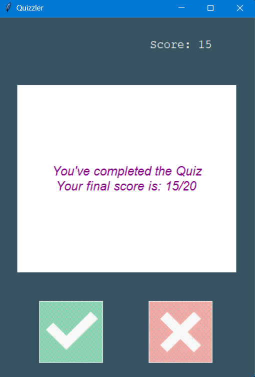

# The Quiz Game

Let's play some quiz. This program gets API data from `open trivia database` and the questions can be  
changed to variety of topics.
 
The core parts of this game are:

<li> It provides a nice UI, and turns the screen from `red` to `green` based on `wrong` and `right` answers  </
li>
<li> These game is entirely built using OOP, which makes it more modular and efficient</li>
<li> The `✅` and `❌` button makes the game more fascinating. </li>
 

<h3 style="font-family: cursive"> Here are some screenshots:  👇</h3>

 

`After the end of the quiz , it displays the final score out of total questions`
 

